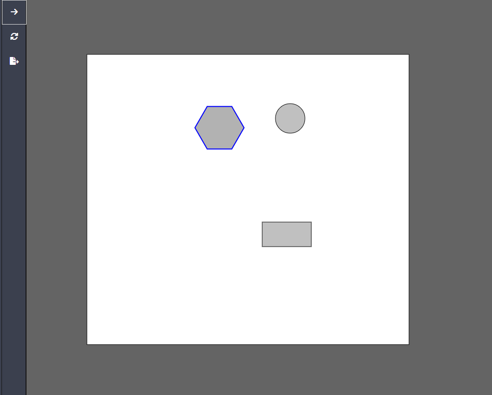

The tool as it is right now:

Random todo:
- [ ] directory struture clean up

- [ ] ctrl + 0 to reset zoom
- [ ] short cuts for all shapes

- [ ] lines
- [ ] add text bot functionality 
~
- [x] resize shapes
- [x] shape names
- [x] shape fill, stroke, strokewidth 

- [ ] delete shapes
- [ ] persist shapes to disk
- [ ] load from disk

- [ ] nested layers shape-manager/layer-manager & ui
- [x] fix layers ui
- [ ] layer UI ordering (top layer ontop of ui)
- [ ] export layers as groups (g)

- [ ] draggable corner of shape for resize 
- [ ] resize while keeping dimensions 
- [ ] rotate shapes

- [ ] guidelines
    - [ ] center/edges of shape on hover
    - [ ] center/edges of other shapes near by
    - [ ] snap to near-by shapes
